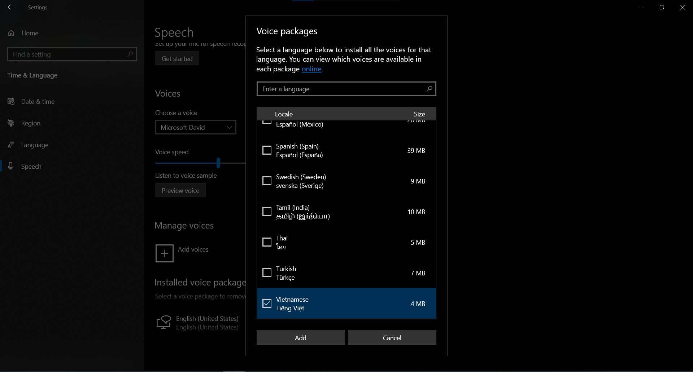
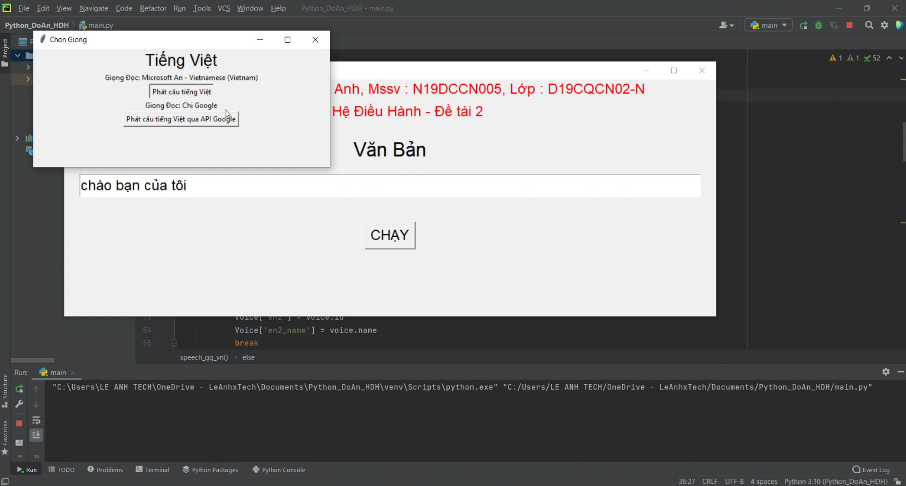
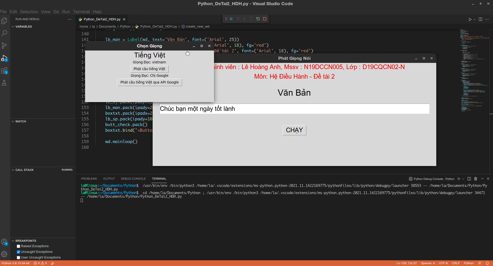

# TextToSpeech_EN_VN
## PTITHCM_3rdYear_1stSemester
## Đồ Án Text To Speech
### Môn : Hệ Điều Hành
### Đề tài : Viết chương trình phát ra loa một câu nói tiếng Việt. Từ đó mở rộng để viết chương trình phát ra loa một văn bản tiếng Anh bất kỳ.

#### Trong bài làm có 1 số module, thư viện không có sẵn cần cài thêm:

*Nếu Linux(Ubuntu) thì chạy lệnh này trước khi chạy bên dưới trên terminal :*   ```sudo apt update && sudo apt install espeak ffmpeg libespeak1```
```
pip install tk
pip install playsound
pip install gTTS
pip install urllib
pip install langdetect
```
**Sinh Viên Thực Hiện : Lê Hoàng Anh**

**MSSV : N19DCCN005**

##### Chú ý : **Nếu là Windown thì phải cài voice hoặc cả ngôn ngữ tiếng Việt (trong setting - time and language) trước rồi chạy file VoiceVI.reg kèm theo (trong thư mục File REG).** Dưới đây là ảnh demo cài voice tiếng Việt trên Windown 10:



### Một số ảnh Demo:



